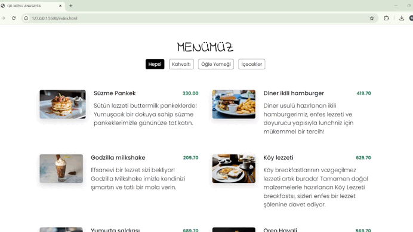

# QR Menu Project
In this project, basic web technologies are used. The dynamic content is created with Javascript and filterable menu options are presented to users according to their categories. 
# Preview

